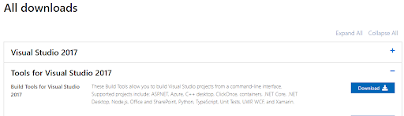

# FAQs for godirect-py (Work In Progress)

## What are the requirements for using godirect-py?

- A [Vernier Go Direct Sensor](https://www.vernier.com/products/sensors/go-direct-sensors)
- A Mac, Windows, or Linux (Ubuntu) computer
- You must have Python3 installed, since godirect is written for Python 3
- You must have the [godirect module and its dependencies installed](#how-do-I-install-the-godirect-module). See the below
- If you wish to connect to your Go Direct device using Bluetooth Low Energy, you will need to have a [Bluegiga BLED112 Bluetooth® Low Energy Dongle](https://www.silabs.com/products/wireless/bluetooth/bluetooth-low-energy-modules/bled112-bluetooth-smart-dongle)

## Why do I have to use Python3?

Python 3.0 was released in 2008. The final 2.x version 2.7 release came out in mid-2010, with a statement of extended support for this end-of-life release. The 2.x branch will see no new major releases after that. 3.x is under active development and has already seen over five years of stable releases, including version 3.3 in 2012, 3.4 in 2014, 3.5 in 2015, and 3.6 in 2016. This means that all recent standard library improvements, for example, are only available by default in Python 3.x. [Source](https://wiki.python.org/moin/Python2orPython3)

## How do I get started with Python?

Here are some generally helpful links for getting started with Python
-  [Python for Beginners](https://www.python.org/about/gettingstarted/)
-  [Official Python FAQs](https://docs.python.org/3/faq/)

## How do I install Python 3?

For Mac, Windows or Linux, you can get the latest installer for Python 3 from [python.org](https://www.python.org/downloads/). We recommend installing the latest available release.

### Installing on Windows

When installing on Windows, be sure to modify the installation to enable the "Add Python to environment variables" option in the "Advanced Options" part of the installer. If you missed this step, you can always modify your installation, like so:

- Go to Add or Remove programs, find Python 3 and select Modify.

- You should now be on the Optional Features screen. Ensure these are selected and click Next.

- You should now be on the Advanced Options screen. Check the “Add Python to environment variables” button, if it is not already checked. Click Install.


## How do I install the godirect module?

### General

Once you have Python3 installed, you will be able to use `pip` (Python package manager) to install the godirect module and other Python modules that you may need. To install the godirect module so that it can work with Go Direct devices over USB and Bluetooth Low Energy (BLE), run the following command:

```pip install godirect[USB, BLE]```

There is further documentation on the [godirect-py project page](https://pypi.org/project/godirect/).

### Windows

Getting the godirect module installed to work with USB on Windows may require some extra steps. It is possible that your install will fail with a message that looks like this:
.

If so, follow the instructions given to download [Microsoft Visual C++ Build Tools](https://visualstudio.microsoft.com/downloads/).

Grab the latest version of the Tools for Visual Studio 2017.


## Where can I find examples of using the godirect module?

- Official examples that use the godirect module can be found in the Vernier [godirect-examples repository](https://github.com/VernierST/godirect-examples).