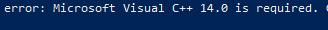
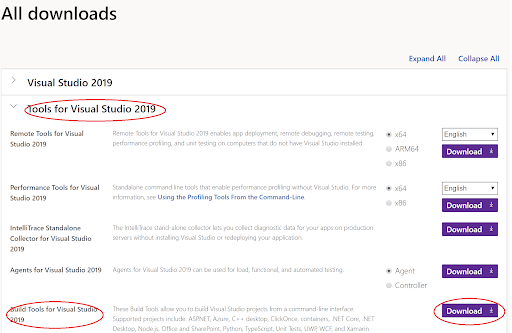
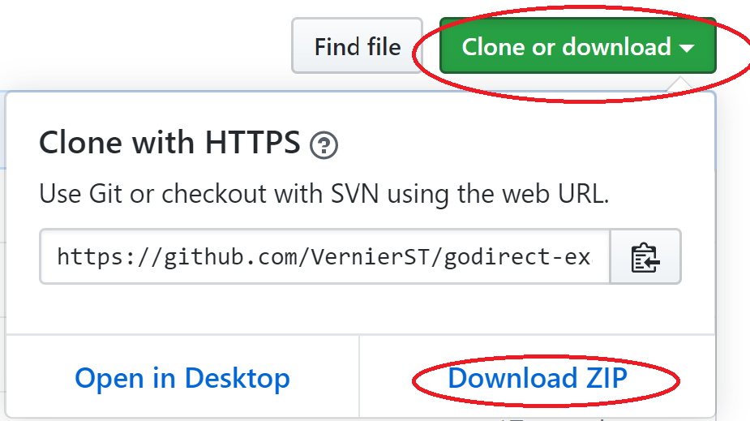
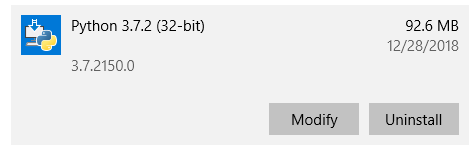

# Getting Started with Vernier Go Direct® Sensors and Python

This guide shows you how to get started writing Python programs for your Vernier Go Direct<sup>1</sup> sensors. The guide contains the following topics:

- [Getting Started Requirements](#getting-started-requirements)
- [Install Python 3](#install-python-3)
- [Choose an IDE](#choose-an-ide)
- [Install the Vernier godirect Module](#install-the-vernier-godirect-module)
- [Confirm Installation of the godirect Module](#confirm-installation-of-the-godirect-module)
- [Download and Run an Example](#download-and-run-an-example)
- [About the Getting Started Examples](#about-the-getting-started-examples)
- [Notes Regarding the gdx Functions](#notes-regarding-the-gdx-functions)
- [Troubleshooting and Notes](#troubleshooting-and-notes)

If you are new to Python you should look over all of the steps. If you are familiar with Python you might just focus on installing the godirect module and downloading the examples.

<sup>1</sup> Go Direct spectrometers are not supported.

## Getting Started Requirements

We have developed a Python module called `godirect` that allows you to communicate with Vernier Go Direct sensors via USB or Bluetooth Low Energy (BLE). This requires the following: 

- A Vernier Go Direct Sensor
- A Windows® 10, macOS®, Linux, or Raspberry Pi computer
- An installation of Python 3
- An installation of the Vernier godirect module for Python 3

## Install Python 3

The godirect module is designed to work with Python 3, it is not compatible with Python 2. In some cases, Python is pre-installed and shipped with your operating system. Use the following steps to check for Python 3 on your machine, and to install Python 3 if needed: 

- Open your operating system's tool for executing commands (on Windows 10 this would be Command Prompt or Powershell, on a Mac or Linux this would be a Terminal window).
- Check to see if Python 3 is already installed on your machine by running the following command:
  - `python --version`
    - If the response is a version of Python 3, it is installed.
    - If there is no response from the command, it is not installed.
    - If the response is a version of Python 2, you will need to try a second command to check for Python 3. Run the following command:  
      - `python3 --version`
- If you have determined that Python 3 is not installed, follow these steps:
  - Find and install the latest installer for Mac, Windows or Linux from python.org. 
  - When installing on Windows, be sure to modify the installation to enable the "Add Python to environment variables". For more information on this, see the [Troubleshooting and Notes](#troubleshooting-and-notes) section of this guide.

## Choose an IDE

With Python installed, you need to choose an application that you will use to write and run your Python programs. You can write your programs in a simple text or code editor, or you can use an Integrated Development Environment (IDE). An IDE is a software application that provides all of the tools to write, comment, edit, debug, develop and run software programs. Python has an IDE bundled with it called IDLE that is cross-platform, and suitable for beginners. If you are new to Python and programming, we recommend that you start with this tool.

Later, you may want to research the various IDEs, learn about the different features, and give one a try. For example, Visual Studio Code is a free IDE available for Windows, Linux, and Mac. There are many other choices, and you can find more information at python.org

## Install the Vernier godirect Module

Once you have Python 3 installed, you will use a tool called `pip` (a Python 3 package manager) to install the godirect module and other Python modules that you may need. Python automatically includes `pip`, so this tool is ready to use. Note that we will be using the **`pip3`** command, rather than just `pip`, to ensure that the Vernier files will be associated with Python 3, and not Python 2.

The `pip3` commands are executed by running them in your operating systems’ tool for executing commands (Powershell, Command Prompt, or Terminal window). There are slight differences in the required steps to install the godirect module for Windows, macOs, and Linux (including Linux running on Raspberry Pi). Follow the steps outlined below for your platform.

### Windows
Run the following command in Powershell or Command Prompt to install the godirect module for USB and BLE:

`pip3 install godirect`

If you received an error during the installation of godirect, part of which looks like the message below, it is probably because your Windows system does not have the appropriate compiler. The godirect module includes a package that requires a C++ compiler.



In order to install without this failure, you will need to follow the instructions to download and install the [command line Build Tools for Visual Studio](https://visualstudio.microsoft.com/downloads/). The latest version of the tools download can be found by scrolling down to the All Downloads section and expanding Tools for Visual Studio (as shown in the figure below). After completing the installation of this tool repeat the `pip3` installation steps for godirect and Bleak.


 
### Mac
Run the following command in Terminal to install the godirect module for USB and BLE: 

`pip3 install godirect`

### Linux (and Linux on Raspberry Pi)
Run the following command in your terminal to install the godirect module for USB and BLE: 

`pip3 install godirect`

Some Linux distributions will not include all of the tools required by the godirect module and its dependencies. If you see errors when you run the `pip3` install, you might need to first install the two packages as shown below, before trying again:

`sudo apt install libusb1.0.0`

`sudo apt install libudev-dev`

In order to communicate with Go Direct devices over USB on Linux systems, you will need to provide a special udev rule that allows the device to be identified when it is plugged in. The rule file is located on our github directory. Use the following steps to download the rule file and then move it to the proper location:
- Download the rule file (vstlibusb.rules) from our [github directory](https://github.com/VernierST/godirect-examples/tree/main/python).
- Use the File Manager to move the vstlibusb.rules file to the Desktop
- Open the terminal
- Navigate to the folder containing the vstlibusb.rules file
  - Run the “cd” command to navigate to the Desktop
    - `cd ~/Desktop`
  - Run the “print work directory” command to verify that you are in the Desktop directory.
    - `pwd`
  - Run the “list” command to verify that the vstlibusb.rules file is on the Desktop.
    - `ls`
  - Move the file to the /etc/udev/rules.d directory using super-user privileges. 
    - Run this command to move the file to the /etc/udev/rules.d directory:
      - `sudo cp vstlibusb.rules /etc/udev/rules.d/.`
  - The rule will not take effect until you plug in a Go Direct device by USB. If a Go Direct device is already connected to the Linux computer, disconnect it and plug it in again. You may need to reboot your device.

## Bluegiga Dongle

If you wish to connect to Go Direct device using a [Bluegiga BLED112 Bluetooth® Low Energy Dongle](https://www.silabs.com/products/wireless/bluetooth/bluetooth-low-energy-modules/bled112-bluetooth-smart-dongle), rather than the native BLuetooth radio, you will need to install the vernierpygatt module with this command:

`pip3 install vernierpygatt`

You will also need to pass `use_ble_bg=True` into the godirect module. There is a comment regarding this in the `gdx.ble_open` function in the gdx.py file.

## Confirm Installation of the godirect Module

At this point, you should have Python 3 installed and have the godirect module installed. Before moving to examples, confirm the installation of the godirect module by showing the version information. Run the following command in the terminal:

`pip3 show godirect`

Running the `pip3 show` command will provide information about the installed package, including the version number. 
Should you need to update to a newer version in the future, run the following command in the terminal:

`pip3 install godirect --upgrade`
 
## Download and Run an Example

With the godirect module installed, it is time to run an example. 
- Go to the [github godirect examples page](https://github.com/VernierST/godirect-examples) and download the files by clicking on the “Clone or download” green button and then clicking on the “Download ZIP” button.



- Locate the zip file in your download folder and extract/unzip the downloaded folder.
- Open your IDE (Visual Studio Code or IDLE, for example).
- From your IDE’s menu, choose File>Open
- Browse to the download and open the folder called “python”.
- Open one of the getting started examples (gdx_getting_started_usb.py, for example) 
- Turn on your Go Direct sensor.
  - If running an example with a USB connection, then connect the sensor via USB.
- Run the Python example. (If you are using IDLE, click on “Run Module” from the Run menu.)

## About the Getting Started Examples

The getting started examples demonstrate how to collect data from Go Direct sensors. Under the hood, these examples all use the godirect module to communicate with the Go Direct devices. However, to make things a bit simpler, we created a layer to abstract some of the details away and provide some simple functions. That layer is named gdx and can be found in the /gdx/ folder (note that this folder must be located in the same directory as the examples or programs that you write that use the gdx functions). All of the getting started examples make use of this layer for a cleaner, simpler entry point into coding with Go Direct devices.

The gdx functions used in a typical program to collect data include:

- `gdx.open_usb()` or `gdx.open_ble()`
- `gdx.select_sensors()`
- `gdx.start()`
- `gdx.read()`
- `gdx.stop()`
- `gdx.close()`

A simple program using the gdx module looks like this:

```python
from gdx import gdx
gdx = gdx.gdx()
 
gdx.open_usb()
gdx.select_sensors()
gdx.start() 
 
for i in range(0,5):
    measurements = gdx.read()
    if measurements == None: 
        break 
    print(measurements)
 
gdx.stop()
gdx.close()
```

## Notes Regarding the gdx Functions 

Here is some more information about the gdx functions, including how you might add arguments to a few of the functions:
```python
from gdx import gdx
gdx = gdx.gdx()
```
- The gdx functions are located in a file named “gdx.py”, located inside a folder named "gdx". In order for the import command to find the gdx file (so that your program can access the functions), the gdx folder needs to be in the same directory as the python program.

### `gdx.open_usb()`
- `gdx.open_usb()` will connect to all Go Direct devices connected via USB. 
- There are no arguments for this function.

### `gdx.open_ble()`
- `gdx.open_ble()` is used in place of `gdx.open_usb()` if the program will connect the Go Direct device(s) via Bluetooth instead of USB. 
- Multiple Go Direct devices can be connected via Bluetooth. 
- If this function’s argument is left blank the function finds all available Go Direct ble devices, prints the list to the terminal, and prompts the user to select the devices to connect.
- There are two ways to use arguments in this function that allow automatic connection to your device without being prompted in the terminal to make the selection.
  - `gdx.open_ble(“GDX-FOR 071000U9, GDX-HD 151000C1”)`
    - If the device name or names is used as the argument in the `gdx.open_ble()` function it will search and connect to those specific Go Direct devices. In the above code snippet a Go Direct Force and Acceleration sensor with a serial number of 071000U9 and a Go Direct Hand Dynamometer with serial number 151000C1 will be opened via Bluetooth.
  - `gdx.open_ble(“proximity_pairing”)`
    - Use “proximity pairing” as the argument in the `gdx.open_ble()` function if you want your program to open the Go Direct device with the strongest rssi signal strength.

### `gdx.select_sensors()`
- Most Go Direct devices have multiple sensors on-board. Use this function to select the sensors you wish to enable for data collection.
- If this function’s argument is left blank, a list of all available sensors is provided by a prompt in the terminal for the user to select from. 
- There are two ways to use arguments in this function that allow automatic connection to your sensors without being prompted in the terminal to make the selection.
  - `gdx.select_sensors([1])`
    - Set the argument as a 1D list to enable sensors for a single device, such as [1] to enable sensor 1 or [1,2] to enable sensors 1 and 2.
  - `gdx.select_sensors([[1,2,3],[1]])`
    - Set the argument as a 2D list of lists of the sensors you wish to enable for multiple Go Direct devices. For example, set the argument as [[1,2,3],[1]] to enable sensors 1,2 and 3 for the first device and sensor 1 for the second device.

### `gdx.start()`
- Start collecting data at a specified period (time between samples) from the sensors that were selected in the `select_sensors()` function.
- Sampling at a period that is less than 10 milliseconds (in other words, greater than 100 samples/second) may be problematic.
- If this function’s argument is left blank, a prompt in the terminal will appear for the user to enter the specified period (in milliseconds).
- It is also possible to use an argument in this function that allows you to set the period without being prompted in the terminal. Simply pass in the period, such as `gdx.start(1000)` to sample every 1000 milliseconds, or `gdx.start(100)` to sample every 100 milliseconds.

### `measurements = gdx.read()`
- The `gdx.read()` function will take single point readings from the selected sensors at the desired period and return the readings as a 1D list.
- Place the function in a loop and make sure the loop can iterate fast enough to keep up with the sampling period (do not have other code in the loop that might slow the loop).

### `gdx.stop()`
- Stop data collection on the selected sensors.
- Calling the `gdx.stop()` function stops data collection but does not disconnect the sensor, so it is possible to start a new round of data collection.

### `gdx.close()`
- Disconnect the Go Direct device from the USB or Bluetooth connection and quit godirect.
- After calling `gdx.close()` you can not call any other gdx functions.

As stated earlier, these gdx functions are available in the gdx.py file, in the gdx folder. The gdx.py file is easy to locate and available for you to modify. Consider adding your own functions, or modifying the functions to meet your needs. 

## Troubleshooting and Notes

### Support
- Contact us at:  support@vernier.com
- If you are familiar with github, you could post a question at: https://github.com/VernierST/godirect-examples/issues
 
### Python
- If you are new to Python, here are some generally helpful links for getting started with Python.
  - [Python for Beginners](https://www.python.org/about/gettingstarted/)
  - [Official Python FAQs](https://docs.python.org/3/faq/)

### Pip
- Be aware if you have Python 2 installed on your machine. This may lead to accidently using Python 2 when you install modules or run code. If you are having issues, make sure you are using the pip3 command to install into Python 3.
- For more information on installing packages in Python go to https://packaging.python.org/tutorials/installing-packages/
 
### Bluetooth
- If you are using Windows, it must be Windows 10.
- The godirect module will pair your Go Direct sensor to your computer. You do not need to manually pair the device in Settings. In fact, this will probably cause issues. 
- If possible, as a first step in troubleshooting, try using your Go Direct sensor with our free [Graphical Analysis™ 4](https://www.vernier.com/product/graphical-analysis-4/) app. Do you have success connecting via Bluetooth with the app?
- If you are using your computer’s on-board Bluetooth and you are getting an error, make sure that you have the latest Bleak module installed:  ```pip3 install bleak```
- Version 1.1.0 of godirect added native BLE support on Windows, Mac and Linux (Including RPi). Version 1.0.6 only supported native BLE on Windows and Linux. Older versions only support Bluetooth with the Bluegiga bluetooth dongle.
- If your computer does not have on-board bluetooth, you can use the Bluegiga bluetooth dongle, as mentioned in the [Bluegiga Dongle](#bluegiga-dongle) section of this document.

### Installing Python on Windows
- When installing on Windows, be sure to modify the installation to enable the "Add Python to environment variables" option in the "Advanced Options" part of the installer. If you missed this step, you can always modify your installation, like so:
- Go to Add or Remove programs, find Python 3 and select Modify.



- You should now be on the Optional Features screen. Ensure these are selected and click Next.


- You should now be on the Advanced Options screen. Check the “Add Python to environment variables” button, if it is not already checked. Click Install.


- If you are using Python v3.8 and installing the bleak module, you may encounter an error like this:

`error: option --single-version-externally-managed not recognized`

This is a known incompatibility and the options to work around it are described here: https://github.com/hbldh/bleak/issues/147

## License

All of the content in this repository is available under the terms of the [BSD 3-Clause License](../LICENSE).

Vernier products are designed for educational use. Our products are not designed nor are they recommended for any industrial, medical, or commercial process such as life support, patient diagnosis, control of a manufacturing process, or industrial testing of any kind.