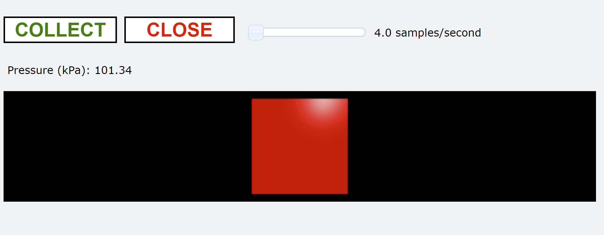
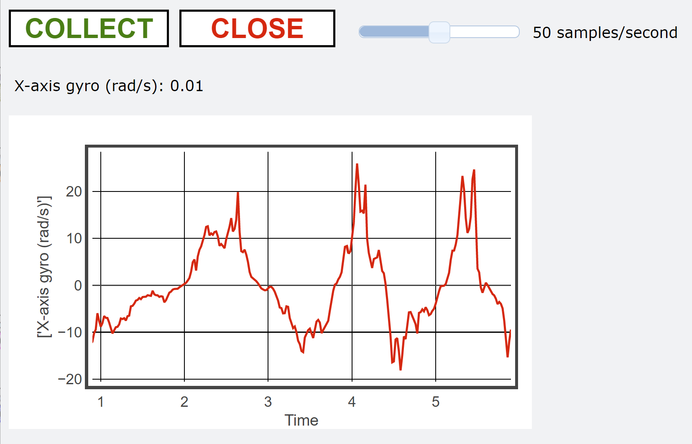

# Getting Started with Vernier Go Direct® Sensors and VPython

This guide describes the use of Go Direct sensor data with the VPython module. The VPython module makes it possible, and easy, for a Python program to generate navigable real-time 3D animations. This is a great tool to illustrate physics concepts.

## Go Direct support in Web VPython

Note that this guide is for using VPython with the installed Python language on one's computer. There is a separate guide for using Go Direct devices with "Web VPython", which runs in the browser and allows the user to write and run a VPython program without actually installing Python itself. This provides a great advantage in the classroom - you do not need to install anything on your computer! Another advantage is that the Web VPython version will work on Chromebooks as well as Mac, Windows, and Linux computers. See [Getting Started with Vernier Go Direct Sensors and Web VPython](https://github.com/VernierST/godirect-examples).

## Getting Started Requirements

The VPython examples are located in the /vpython_examples/ folder. Just like the 'getting_started' examples, these examples use the local module named `gdx`. A copy of `gdx` is included with the vpython examples so that Python can easily find this module.

The VPython module must be installed to run the examples. Run the following command in Powershell or Command Prompt to install the VPython module:

`pip install vpython`

## About the gdx Module

The `gdx` module contains functions that will be used in the VPython examples. This is the same module that has functions for data collection and discussed in the [Getting Started with Vernier Go Direct® Sensors and Python](https://github.com/VernierST/godirect-examples/tree/main/python) manual.

Note that a copy of the /gdx/ folder is located in the directory with these examples. This copy is included in order to make it easy for Python to find the `gdx` module. If you ever run an example that imports the `gdx` module and you receive the error `ModuleNotFoundError: No module named 'gdx'`, remember to either:

1. Keep the /gdx/ folder in the same directory as the example that you are running.
2. Manually move the /gdx/ folder into your Python /site-packages/ directory. This is the same directory that all Python libraries are placed, and it is a "path" that Python looks for modules.
3. Add code to your program to create a system 'path' to the directory where the /gdx/ folder is located. For example, here is code to add a system 'path' one directory up.  

```python
import os
import sys

file_path = os.path.abspath(os.path.dirname(sys.argv[0]))
os.chdir(file_path)
os.chdir("..")
gdx_module_path = os.getcwd()
if gdx_module_path not in sys.path:
    sys.path.append(gdx_module_path)
```

## The gdx Functions for VPython

The gdx functions for VPython that make it easy to collect and display Go Direct sensor data include:

- `gdx.vp_vernier_canvas()`
- `gdx.vp_close_is_pressed()`
- `gdx.vp_collect_is_pressed()`
- `gdx.vp_get_slider_period()`

A simple example that uses these functions is shown below. In this example, the length of the VPython box object is controlled by the sensor data. 



```python
from gdx import gdx
from vpython import *
gdx = gdx.gdx()

gdx.open(connection='usb')
gdx.select_sensors()
gdx.vp_vernier_canvas()    
b = box(size=0.1*vec(1,1,1), color=color.red)
gdx.start(period=250)
 
while gdx.vp_close_is_pressed() == False:
    while gdx.vp_collect_is_pressed() == True:       
        measurements = gdx.read()     
        sensor0_data =  measurements[0]  
        b.length = 0.1 * sensor0_data 
```

## Notes Regarding the gdx VPython Functions 

The code snippet above uses functions available in the gdx module that provide some convenient features for your VPython program. Here is some more information about the functions:

### `gdx.vp_vernier_canvas()` 
- Use this function to add VPython objects that are useful for data collection to the VPython canvas.
- If this function’s argument is left blank, the following objects will be placed onto the VPython canvas:


- COLLECT/STOP button
  - Click this button to start and stop data collection
- CLOSE button
  - Click this button to end your VPython session, disconnect the Go Direct device from the USB or Bluetooth connection, and quit godirect.
- Slider
  - Modify the data collection sampling rate with this slider.  
- Live meter readout
  - This VPython object provides a live display of the Go Direct sensor reading. This reading is active at all times (even when data collection has been stopped). This can be useful for configuring your experiment prior to starting data collection.  
- The default settings for the arguments are as follows:
`vp_vernier_canvas(buttons=True, slider=True, meters=True, chart=False, cvs=True)`
- The buttons, slider, and live meter were discussed above. You can disable these VPython objects by setting `buttons=False`, `slider=False`, or `meters=False`
- If the chart parameter is set to `chart=True`, a VPython chart object will be added to the scene as shown below.



- The chart will automatically update during the data collection loop. The active sensor measurements will be plotted against time.
- The argument `cvs=True` creates a blank canvas for any VPython objects (such as an arrow, box, sphere, etc..) you would like to include in your program. 
  - If you do not like the size of the default canvas, simply create your own canvas after calling `gdx.vp_vernier_canvas()`, and then create the object to go on the canvas:

```python
gdx.vp_vernier_canvas()    
my_canvas = canvas(height=500, width=400)
my_sphere = sphere(radius=25, color=color.red)
```

### `while gdx.vp_close_is_pressed() == False`
- The function `gdx.vp_close_is_pressed()` monitors the state of the vpython canvas CLOSE button. 
- When true, this function will call gdx.stop() and gdx.close() to stop data collection and disconnect the device.

### `while gdx.vp_collect_is_pressed() == True`
- The function `gdx.vp_collect_is_pressed()` monitors the state of the vpython canvas COLLECT/STOP button.
- When COLLECT is clicked, the function will call gdx.start(). When STOP is clicked, a 
gdx.stop() is called.

### `gdx.vp_get_slider_period()`
- The slider is used to modify the data collection sampling rate. This function returns the value of the slider. The value is returned as the period (dt) in milliseconds.
 
## Troubleshooting
- If you are familiar with github, you could search the issues or post a question at: https://github.com/VernierST/godirect-examples/issues
- Try a different browser for the VPython scene. In most cases using Chrome is suggested.
- Place the `gdx.vp_canvas()` function before `gdx.start()` in your code. This is because there is code in the `gdx.start()` function that checks to see if the data collection rate might be coming from the VPython slider that is configured in `gdx.vp_canvas()`. 
- Write a simple VPython starter program that does not use GO Direct sensors and does not use the functions described above. This can be a good troubleshooting step if you are not sure why VPython is not launching. Here is an easy example to try:

```python
from vpython import *
sphere()
```

- After running a program using VPython, the terminal may become unresponsive. If so, delete the terminal and open a new terminal before running the program a second time.
- If you receive the error `ModuleNotFoundError: No module named 'gdx'`, remember to place a copy of the /gdx/ folder in the same directory as your file, or in the site-packages directory, or create code to add a system path to the location of the /gdx/ folder.
- To check your version of VPython run the following command in your terminal:

`pip show vpython`

- If you receive the error "can't find '__main__' module", it might be that you have not saved your file.
- If you receive an error that the VPython module cannot be found, it might not have been installed. Run the following command in your terminal:

`pip install vpython`

- We have created a [FAQ for Python Troubleshooting](https://www.vernier.com/til/16133)

## License

All of the content in this repository is available under the terms of the [BSD 3-Clause License](../LICENSE).

Vernier products are designed for educational use. Our products are not designed nor are they recommended for any industrial, medical, or commercial process such as life support, patient diagnosis, control of a manufacturing process, or industrial testing of any kind.
