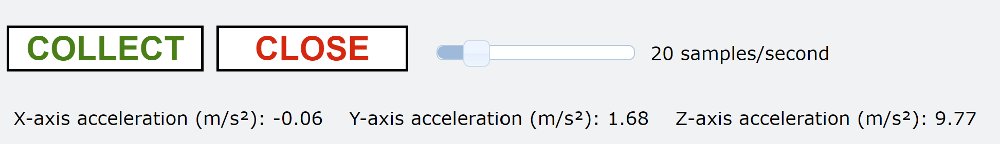

# Getting Started with Vernier Go Direct® Sensors and Web VPython

This guide shows how to get started writing Web VPython programs to communicate with the sensors on-board most Vernier Go Direct<sup>1</sup> devices. Web VPython is an easily accessible online coding platform that bundles Python and the VPython library.

Web VPython runs in the browser and makes it possible, and easy, to generate navigable real-time 3D animations. In addition, it allows the user to write and run a VPython program without actually installing Python itself - a big timesaver in the classroom! Another advantage is that Web VPython can communicate with Go Direct sensors on Chromebooks as well as Mac, Windows, and Linux computers.

This guide contains the following topics:

- [Go Direct support in Python](#go-direct-support-in-python)
- [Getting Started Requirements](#getting-started-requirements)
- [About the godirect Web VPython library](#about-the-godirect-web-vpython-library)
- [The Web VPython Functions](#the-web-vpython-functions)
- [Notes Regarding the Web VPython Functions](#notes-regarding-the-web-vpython-functions)
- [How to Run a Web VPython Program with Go Direct Devices](#how-to-run-a-web-vpython-program-with-go-direct-devices)
- [Example Programs](#example-programs)
- [Troubleshooting and Notes](#troubleshooting)

<sup>1</sup> Go Direct spectrometers, Mini GC, Polarimeter, Go Wireless Heart Rate, and Cyclic Voltammetry System do not work with the godirect library. Go Direct sensors that are not supported, or that may require advanced programming, calibration, or analysis, include Blood Pressure, Sound, Ion-Selective Electrode, Optical Dissolved Oxygen, Conductivity, and timing/event devices like Photogates, Drop Counters, Projectile Launcher, Radiation, and Rotary Motion.

## Go Direct support in Python

Note that this guide is for using VPython with Web VPython. There is a separate guide for using Go Direct devices with the installed Python language on one's computer - this includes VPython support. See [Getting Started with Vernier Go Direct Sensors and Python](https://github.com/VernierST/godirect-examples/tree/main/python).

## Getting Started Requirements

We have developed a library called `godirect` that allows you to develop Web VPython programs that can communicate with the sensors of a Vernier Go Direct device via USB or Bluetooth Low Energy (BLE). This requires the following: 

- A Vernier Go Direct Device
- A Chromebook, Windows® 10, macOS®, or Linux (including Raspberry Pi) computer
- Access to glowscript.org. It is recommended to use the Chrome browser, though other browsers may work.

## About the godirect Web VPython library

The `godirect` library for Web VPython is a JavaScript library that provides a series of functions that can be used to write Python code in Web VPython. These functions provide communication with Go Direct devices. Additionally, the functions provide buttons, sliders, meters, and a chart for controlling data collection within Web VPython.

Start your Web VPython program using the following command to get the library
```python
get_library("https://unpkg.com/@vernier/godirect/dist/webVPython.js")
```

## The Web VPython Functions

The functions for Web VPython that make it easy to collect and display Go Direct sensor data include:

- `gdx.open()`
- `gdx.select_sensors()`
- `gdx.vp_vernier_canvas()`
- `gdx.start()`
- `gdx.vp_close_is_pressed()`
- `gdx.vp_collect_is_pressed()`
- `gdx.read()`
- `gdx.vp_get_slider_period()`

A simple example that uses these functions is shown below. In this example, the length of a VPython box object is controlled by sensor data. 


```python
Web VPython 3.2
get_library("https://unpkg.com/@vernier/godirect/dist/webVPython.js")

gdx.open(connection='usb')
gdx.select_sensors()
gdx.vp_vernier_canvas()    
b = box(size=0.1*vec(1,1,1), color=color.red)
gdx.start()
 
while gdx.vp_close_is_pressed() == False:
    rate(50)
    while gdx.vp_collect_is_pressed() == True: 
        rate(50)      
        measurements = gdx.read()     
        sensor0_data =  measurements[0]  
        b.length = 0.1 * sensor0_data 
```

## Notes Regarding the Web VPython Functions 

Here is some more information about the functions, including how you might add arguments to a few of the functions:

### `gdx.open()`
- There are two parameters that can be used, `connection=` and `device_to_open=`
- The `connection=` parameter can be set to connect Go Direct devices to either USB `'usb'` or Bluetooth `'ble'`
  - `gdx.open(connection='usb')` 
  - `gdx.open(connection='ble')`
- If the `device_to_open=` argument is left blank the function finds all available Go Direct devices, prints the list, and prompts the user to select the devices to connect.
- You can also set `device_to_open=` with your device name or names.  
  - `gdx.open(connection='usb', device_to_open=“GDX-FOR 071000U9, GDX-HD 151000C1”)`
  - `gdx.open(connection='ble', device_to_open=“GDX-FOR 071000U9, GDX-HD 151000C1”)`
    - If the device name or names is used as the argument in the `gdx.open()` function you still need to manually select the device to connect. However, this allows you to know which device is the first device and which is the second (if you are opening two devices, for example).

### `gdx.select_sensors()`
- Most Go Direct devices have multiple sensors on-board. Use this function to select the sensors you wish to enable for data collection.
- If this function’s argument is left blank, a list of all available sensors is provided on the Web VPython canvas for the user to select from. 
- There are two ways to use arguments in this function that allow automatic connection to your sensors without being prompted in the terminal to make the selection.
  - `gdx.select_sensors([1])`
    - Set the argument as a 1D list to enable sensors for a single device, such as [1] to enable sensor 1 or [1,2] to enable sensors 1 and 2.
  - `gdx.select_sensors([[1,2,3],[1]])`
    - Set the argument as a 2D list of lists of the sensors you wish to enable for multiple Go Direct devices. For example, set the argument as [[1,2,3],[1]] to enable sensors 1,2 and 3 for the first device and sensor 1 for the second device.
- How do you know what sensors are on your device and what the sensor numbers are? Simply run an example leaving the `gdx.select_sensors()` argument blank and you will see the list in the Web VPython canvas.

### `gdx.start()`
- If this function’s argument is left blank, a default period is set and can be modified using the slider available from `gdx.vp_vernier_canvas()`.
- Sampling at a period that is less than 10 milliseconds (in other words, greater than 100 samples/second) may be problematic.
- Set the default sampling period using an argument. Simply pass in the period, such as `gdx.start(1000)` to sample every 1000 milliseconds, or `gdx.start(100)` to sample every 100 milliseconds.

### `measurements = gdx.read()`
- The `gdx.read()` function will take single point readings from the selected sensors at the desired period and return the readings as a 1D list.
- Place the function in the data collection loop and make sure the loop can iterate fast enough to keep up with the sampling period (do not have other code in the loop that might slow the loop).

### `gdx.vp_vernier_canvas()` 
- Use this function to add VPython objects that are useful for data collection to the VPython canvas.
- If this function’s argument is left blank, the following objects will be placed onto the VPython canvas:



- COLLECT/STOP button
  - Click this button to start and stop data collection
- CLOSE button
  - Click this button to end your VPython session, disconnect the Go Direct device from the USB or Bluetooth connection, and quit godirect.
- Slider
  - Modify the data collection sampling rate with this slider.  
- Live meter readout
  - This VPython object provides a live display of the Go Direct sensor reading. This reading is active at all times (even when data collection has been stopped). This can be useful for configuring your experiment prior to starting data collection.  
- Channel setup
  - Provides a device control box that lists all of sensors for the device and the ability to add or remove devices.
- The default settings for the arguments are as follows:
`vp_vernier_canvas(buttons=True, slider=True, meters=True, chart=False, channel_setup=True)`
- The buttons, slider, live meter, and channel_setup were discussed above. You can disable these VPython objects by setting `buttons=False`, `slider=False`, `meters=False`, or `channel_setup=False`
- If the chart parameter is set to `chart=True`, a VPython chart object will be added to the scene as shown below.


- The chart will automatically update during the data collection loop. The active sensor measurements will be plotted against time.

### `while gdx.vp_close_is_pressed() == False`
- The function `gdx.vp_close_is_pressed()` monitors the state of the vpython canvas CLOSE button. 
- When true, this function will call gdx.stop() and gdx.close() to stop data collection and disconnect the device.

### `while gdx.vp_collect_is_pressed() == True`
- The function `gdx.vp_collect_is_pressed()` monitors the state of the vpython canvas COLLECT/STOP button.
- When COLLECT is clicked, the function will call gdx.start(). When STOP is clicked, a 
gdx.stop() is called.

### `gdx.vp_get_slider_period()`
- The slider is used to modify the data collection sampling rate. This function returns the value of the slider. The value is returned as the period (dt) in milliseconds.

## How to Run a Web VPython Program with Go Direct Devices

When creating a new Web VPython program, or editing an existing program, you will see the option to "Run this program" in the editor. That option will work for VPython code that does not include Go Direct devices. But if your program does include Go Direct devices you must download your program to run it. In order to run a program that includes a Go Direct device, you will need to: 

- choose `Share or export this program`
- and then `Download as HTML`
  - Note: Before clicking `Download as HTML` look to make sure the area at the bottom of the page is not blank. If it is, there is a bug in the code. Go back to the editor to fix the code.
- Once the .html file has downloaded to your computer, click on the .html file. This will open and run the program in your browser.

## Example Programs

Web VPython's landing page at https://glowscript.org/ allows users to create accounts for saving and sharing example programs. Find examples for Go Direct devices at:

https://www.glowscript.org/#/user/vernier-web-vpython/folder/MyPrograms/

## Troubleshooting

- To run a program you must click `Share or export this program` and then `Download as HTML`. Before clicking on `Download as HTML`, look at the bottom of the page to make sure there is code in the window. If not, there is an error. To locate the error, go back to the editor and click `Run this program`. You may or may not receive some helpful error messages. Otherwise, comment out code to simplify your starter program. 
- If you are familiar with github, you could search the issues or post a question at: https://github.com/VernierST/godirect-examples/issues
- Try a different browser for the VPython scene. In most cases using Chrome is suggested.
- Place the `gdx.vp_canvas()` function before `gdx.start()` in your code. This is because there is code in the `gdx.start()` function that checks to see if the data collection rate might be coming from the VPython slider that is configured in `gdx.vp_canvas()`. 
- Write a simple VPython starter program that does not use GO Direct sensors and does not use the functions described above. This can be a good troubleshooting step if you are not sure why VPython is not launching. Go to https://glowscript.org/ and sign in. Go to your programs and create a new program. Here is an easy example to try:

```python
Web VPython 3.2
sphere()
```

- Ask a question on the glowscript forum at:  https://groups.google.com/g/glowscript-users
- We have created a [FAQ for Python Troubleshooting](https://www.vernier.com/til/16133)

## License

All of the content in this repository is available under the terms of the [BSD 3-Clause License](../LICENSE).

Vernier products are designed for educational use. Our products are not designed nor are they recommended for any industrial, medical, or commercial process such as life support, patient diagnosis, control of a manufacturing process, or industrial testing of any kind.
